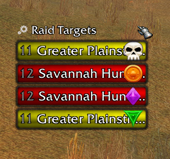
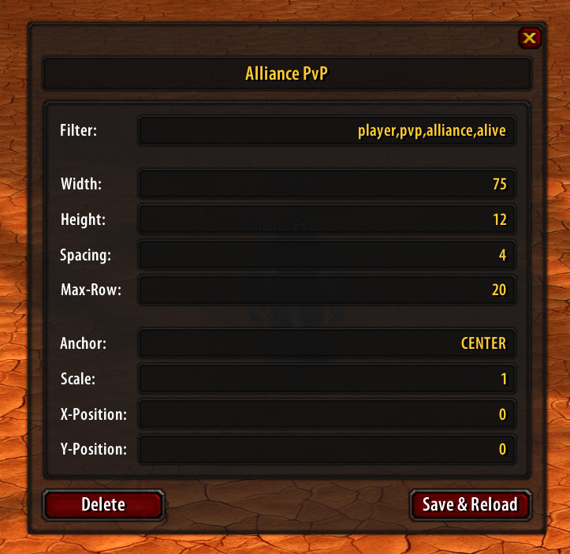
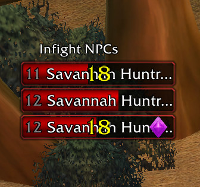

# ShaguScan

An addon that scans for nearby units and filters them by custom attributes.
It's made for World of Warcraft: Vanilla (1.12.1) and is only tested on [Turtle WoW](https://turtle-wow.org/).

The addon can be used to see all marked raid targets, detect rare mobs, find nearby players that decided to do pvp, and much more!

> [!IMPORTANT]
>
> **This addon requires you to have [SuperWoW](https://github.com/balakethelock/SuperWoW) installed.**
>
> It won't work without it. Really.

## Installation (Vanilla, 1.12)
1. Download **[Latest Version](https://github.com/shagu/ShaguScan/archive/master.zip)**
2. Unpack the Zip file
3. Rename the folder "ShaguScan-master" to "ShaguScan"
4. Copy "ShaguScan" into Wow-Directory\Interface\AddOns
5. Restart Wow

# Usage

Multiple windows can be created that each show health bars of nearby units based on custom filters. A new window with the title "Alliance PvP" can be created by typing `/scan Alliance PvP`. A configuration will appear, in which the created window can be customized. You can chose as many filters as you wish (comma separated).

In case `/scan` is already blocked by another addon, you can also use `/sscan` or `/shaguscan`.

As a filter you could for example choose: `player,pvp,alliance,alive` to only show players with pvp enabled on the alliance side that are alive.

You can build the lists as you want them, there are now limits as long as the filter for it exists.

# Filters

- **player**: all player characters
- **npc**: all non-player characters
- **infight**: only units that are in combat
- **dead**: only dead units
- **alive**: only alive units
- **horde**: only horde units
- **alliance**: only alliance units
- **hardcore**: only hardcore enabled players
- **pve**: only pve-flagged units
- **pvp**: only pvp-flagged units
- **icon**: only units with an assigned raid icon
- **normal**: only units of type "normal" (no elite, rare, etc.)
- **elite**: only units of type "elite" or "rareelite"
- **rare**: only units of type "rare" or "rareelite"
- **rareelite**: only units of type "rareelite"
- **worldboss**: only units of type "worldboss"
- **hostile**: only hostile units
- **neutral**: only neutral units
- **friendly**: only friendly units
- **attack**: only units that can be attacked
- **noattack**: only units that can't be attacked
- **pet**: only units that are pet or totems
- **nopet**: only units that aren't pets or totems
- **human**: only human players
- **orc**: only orc players
- **dwarf**: only dwarf players
- **nightelf**: only night elf players
- **undead**: only scourge players
- **tauren**: only tauren players
- **gnome**: only gnome players
- **troll**: only troll players
- **goblin**: only goblin players
- **highelf**: only high elf players
- **warlock**: only warlock players
- **warrior**: only warrior players
- **hunter**: only hunter players
- **mage**: only mage players
- **priest**: only priest players
- **druid**: only druid players
- **paladin**: only paladin players
- **shaman**: only shaman players
- **rogue**: only rogue players
- **aggro**: units that target you
- **noaggro**: units that don't target you
- **pfquest**: units that have a pfquest tooltip
- **range**: units that are within max [interaction distance](https://wowwiki-archive.fandom.com/wiki/API_CheckInteractDistance) (28y)
- **level:NUMBER**: units that are level NUMBER
- **minlevel:NUMBER**: units that are at least level NUMBER
- **maxlevel:NUMBER**: units that are at most level NUMBER
- **name:STRING**: units that have STRING in their name

New and custom filters are easy to implement, if you wish to create your own, please have a look at: [filter.lua](./filter.lua).
